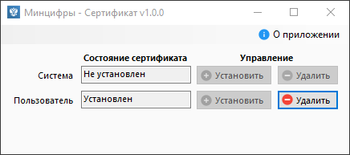

# Минцифры - Сертификат [![Build artifact][build-src]][build-href] <!-- [![Codacy Badge][codacy-src]][codacy-href] -->

Приложение для установки/удаления сертификата Минцифры в пару кликов.

## Использование

1. Запустить приложение.
2. Установит/Удалить сертификат.
3. ????
4. PROFIT!!!

## Примечания

* Для установка/удаление сертификата в систему нужно запустить приложение от имени администратора
* Если сертификат установлен в систему, то пользователь наследует его и не может его удалить

<!-- Badges -->
[build-src]: https://img.shields.io/github/actions/workflow/status/Virenbar/MincifryCertificate/build-artifact.yml?label=Build&logo=github
[build-href]: https://github.com/Virenbar/MincifryCertificate/actions/workflows/build-artifact.yml

<!-- [codacy-src]: <...> -->
<!-- [codacy-href]: <...> -->